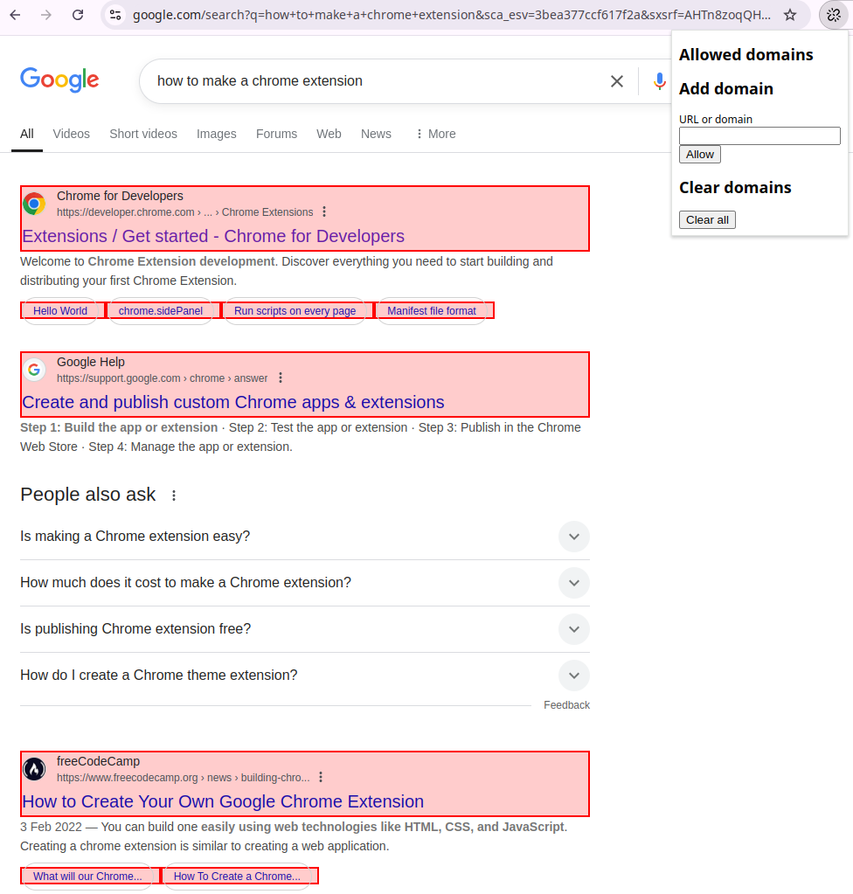
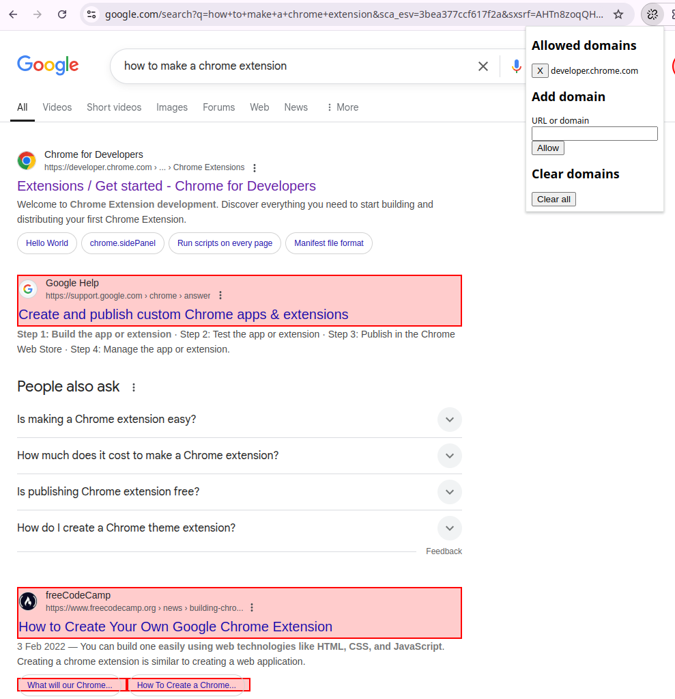

# README

**Goal**: to add a little friction and visibility when links might be pointing to malicious destinations. Needs to work in GMail web client.

A Chrome extension to highlight links on a page that do not point back to the origin domain or subdomains. Supports a list of trusted domains and subdomains that are not highlighted. Domains and URLs can be added. URLs are parsed to domains. Subdomains are also trusted, as ownership of a domain is pre-requisite to creating subdomains. They can also be removed individually or cleared.

With no domains set, a Google search looks like this:

Adding `developer.chrome.com`, the highlight and click prevention for the first result is removed.

`support.google.com` is still highlighted, as the page host value is `www.google.com`. Adding `google.com` to the trusted domains list removes highlighting and click prevention from `support.google.com` along with any other subdomains like `mail.google.com`.

Clicking highlighted links is blocked, but you can right-click and open in new tab to one-off open a link without trusting the domain.

## Installation

Cloning the repo and install the unpacked extension via chrome://extensions.

## Disclaimer

This project is provided **as-is** with no guarantees, warranties, or support of any kind. The maintainer does not provide assistance, updates, or bug fixes. 

**Use this project entirely at your own risk.** The maintainer is not responsible for any issues, damages, or losses that may arise from using this software.

## Usage

Feel free to explore and use the code, but please note that you are solely responsible for understanding and managing any risks involved.

## Contribution

Contributions are welcome, but please be aware that they may not be reviewed or merged. Raise an issue first to avoid wasted time and disappointment.

## License

This project is licensed under MIT license. Refer to the license file for more details.